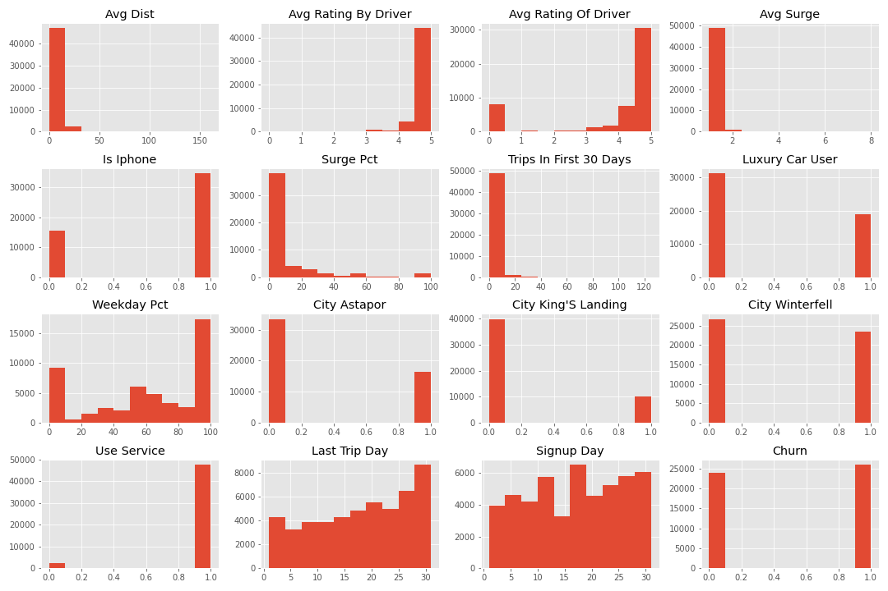

# How to prevent rider churning

**This project aims to understand the factors that lead to rider churning and explore methods to improve rider retention rate.**

<details>

<summary>Data Overview</summary>

---
**Data consist of 12 columns and 50000 observations. The following three columns (Average Rating by Driver, Average Rating of Driver, and Phone) contain missing data, noted in the table below.**

|#   |Column                 | Misisng |  Dtype |
|--- | ------                |  -------| -----  |
| 0  | avg_dist              |  0      | float64|
| 1  | avg_rating_by_driver  |  201|  float64|
| 2  | avg_rating_of_driver  |  8122|  float64|
| 3  | avg_surge             |  0|  float64|
| 4  | city                  |  0|  object |
| 5  | last_trip_date        |  0|  object |
| 6  | phone                 |  396|  object |
| 7  | signup_date           |  0|  object |
| 8  | surge_pct             |  0|  float64|
| 9  | trips_in_first_30_days|  0|  int64  |
| 10 | luxury_car_user       | 0| bool   |
| 11 | weekday_pct           | 0| float64|
</details>

---

<details>

<summary>Exploratory Data Analysis </summary>

### Table of Missing Values

|Column| Imputed As: | Why?|
|------|--------------|-----|
|Average Rating by Driver| 0 | Customers with missing ratings have never been rated before.|
|Average Rating of Driver| 0 | Drivers with missing ratings have never been rated before|
|Phone| "Andriod" | Variable changed to is_iphone. If not, then we assume it is something else, i.e., Andriod. |

### Feature Engineering

|New Column| Created From| Levels|
|------|--------------|-----|
|is_phone|Phones which are iphones| True or False|
|city_Astapor          | City of Astapor|True or False|
|city_King's Landing   | City of King's Landing  |True or False|
|city_Winterfell       |City of Winterfell|True or False|
|last_trip_day         |Day of last trip date | 1 - 31|
|last_trip_month       |Month of last trip date| 1 - 12|
|signup_day            |Day of signup date | 1 - 31|
|signup_month          |Month of signup date| 1 - 12|
|use_service          |last trip data minus signup date  greater than 1| True or False|
|**churn**| *target* :: Last trip date less greater than 30 days. |True or False|

</img>

</details>

---

<details>

<summary>Models</summary>

    The accuracy score is used to evaluate the following classification models. It is defined as the fraction of predictions our model got right.

> **Random Forest Classifier**

> **Gradient Boosting Classifier**

```python
# The model is create with the followin prameters: 
learning_rate = 0.1 
n_estimator = 100
subsamples = 1.0
min_sample_split = 2
min_sample_leaf = 1
max_depth = 3
min_impurity_decrease = 0
```
 
Model|Precision|Recall|Accuracy|
-----|---------|------|--------|
Random Forest Classifier||||
Gradient Boosting Classifier|0.762|0.793|0.762|

</details>

---
### Conclusion

---
---
<details>

<summary> Data Dictionay </summary>

|#  |Column                | Count | Dtype | Definition|
|---|  ------              |-------|-------| ----------|
| 0 |  avg_dist            |    50000 | float64|The average distance (in miles) per trip taken in the first 30 days after signup|
| 1 |  avg_rating_by_driver|    50000 | float64|The rider’s average rating over all of their trips|
| 2 |  avg_rating_of_driver|    50000 | float64|The rider’s average rating of their drivers over all of their trips|
| 3 |  avg_surge           |    50000 | float64|The average surge multiplier over all of this user’s trips|
| 4 |  is_iphone           |    50000 | int64  |If driver use Iphone|
| 5 |  surge_pct           |    50000 | float64|The percent of trips taken with surge multiplier > 1|
| 6 |  trips_in_first_30_days|  50000 | int64  |The number of trips this user took in the first 30 days after signing up|
| 7 |  luxury_car_user       |  50000 |  int64  |1 if the user took a luxury car in their first 30 days; 0 otherwise|
| 8 |  weekday_pct           |  50000 |  float64|The percent of the user’s trips occurring during a weekday|
| 9 |  city_Astapor          |  50000 |  uint8  |City of Astapor|
| 10|  city_King's Landing   |  50000 |  uint8  |City of King's Landing
| 11|  city_Winterfell       |  50000 |  uint8  |City of Winterfell|
| 12|  last_trip_day         |  50000 |  int64  |Day of last trip|
| 13|  last_trip_month       |  50000 |  int64  |Month of last trip|
| 14|  signup_day            |  50000 |  int64  |Day of signup|
| 15|  signup_month          |  50000 |  int64 |Month of signup|
|16 | churn| 50000|uint8| 1 if rider churned|

</details>